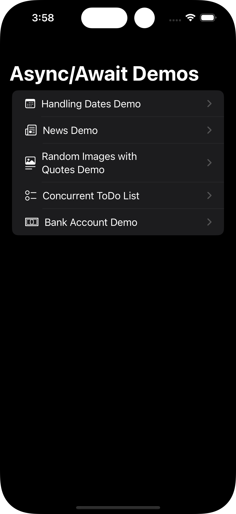

    

<h1 align="center">
    Async Await Master
</h1>

    
     
    

Welcome to Async/Await Master!
This app is designed to showcase various features of concurrency in Swift, including async/await, actors, tasks, and more.

## Features
- **Async/Await:** See how this implementation works on various scenarios.
- **Actors:** Take a look about how actors can work with hogh loads.
- **Task Groups:** We use Task Groups to manage concurrent tasks
- **Structured concurency:** Discover the benefits of structured concurrency.

## Getting Started
Simply clone this app, open in Xcode and sync the dependencies via Swift Package Manager.

### How to use the App
1 - Navigate into the sections

2 - You can see the goal and explanation of each demo

3 - The NewsDemo page requires an apiKey for the news service. You can get one in <a href="https://newsapi.org/register">https://newsapi.org/register</a>

## Contributing
If you have any suggestions or improvements, feel free to create a pull request or open an issue. Contributions are always welcome!

## Aknowledgements
Special thanks to the instructor <a href="https://globant.udemy.com/user/mohammad-azam-2/">Mohammad Azam</a> for inspiring this app. You can see the original examples on his<a href="udemy.com/course/asyncawait-and-actors-concurrency-in-swift/"> Udemy course</a>

Happy Coding!